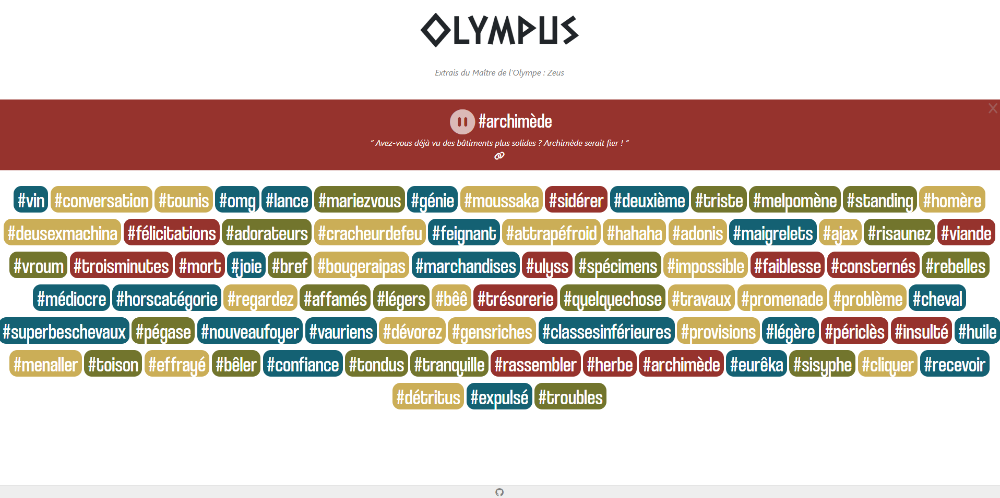

# Zeus : Master of Olympus - Soundboard

This is a small project that aims to mimic [ouich.es](https://ouich.es/) website, but using audio samples from the game "Zeus : Master of Olympus".

As I write this, in May 2024, you can visit the website [here](https://olympus-k7cj.onrender.com/).

If you're interested in learning more about the game, visit this [link](https://www.masterofolympus.com/).

**NB**: This is my first experience using Poetry for dependency management. If you notice any unconventional usage or have suggestions for improvement, please feel free to share them with me. Your feedback is greatly appreciated !



## Prerequisites

You have `python3.11` and [you're able to use poetry](https://python-poetry.org/docs/)

## Setup

```shell
poetry shell
poetry install
```

## How to run

```shell
./run.sh
```

## How to test

```shell
poetry run pytest
```